# React Firebase Tutorial

作成日：2020/05/20

更新日：2020/05/20

## 今回の講座のゴール
- ReactとCloud Firestoreを用いて動的なアプリケーションを構築する．
- ReactでのCRUD処理の基本を理解する．


## 今回作成するアプリケーション

- ReactとCloud Firestoreを用いたtodoリスト．
- 入力フォームから登録内容を送信．
- 保存されている内容を一覧表示し，更新（完了未完了）と削除を行えるようにする．
- 完了した項目はリスト下部に移動させ，取り消し線で表示する．


## 【必須】事前準備

- `https://console.firebase.google.com/`にアクセスし，`react-firebase`という名前でFirebaseのプロジェクトを新規作成する．
- DatabaseタブからCloud Firestoreのデータベースを作成する(必ずテストモードで開始しておく．ロケーションは`us-central`のままでOK)．
．
- `todos`という名前でコレクションを作成する．
  - IDは自動ID．
  - フィールドは`todo`（string），`isDone`（boolean），`limit`（timestamp）の3つを作成．
  - 値は`isDone`のみ`false`であとは適当で問題なし．

Cloud Firestoreのコンソール画面で下のように表示されていればOK．

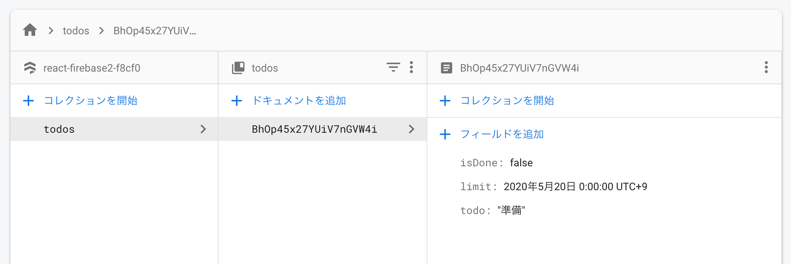


## 今回の内容の前提

オンライン講座と課題を完了していればOK！

- Reactを用いた基礎的な実装を行った経験がある．
- React Hooksを用いた実装の経験がある．
- component，propsなどの意味，配列の基本的な処理を把握している．


## 環境構築

### 必要なツールのバージョン確認
- Node.jsとnpmが必要なので，以下のコマンドで状況を確認する．
- バージョンが表示されればOK．
```bash
$ node -v
v12.15.0
$ npm -v
6.14.5
```

### プロジェクトの作成
- 今回は`react-firebase`という名前でプロジェクトを作成する．

```bash
$ npx create-react-app react-firebase
```

※`npm`ではなく`npx`である点に注意！

いい感じにできたら，以下のコマンドでディレクトリに移動し，サーバを起動する．

```bash
$ cd react-app
$ npm start
```

自動的にブラウザが立ち上がり，以下のような画面が表示されればOK．


表示を確認したら`control + c`で停止しておく．

### メイン画面の編集と不要なファイルの削除

メイン画面の不要な記述を削除し，使用しないファイルも削除する．

`App.js`のファイル名を`App.jsx`に変更し，内容を以下のように編集する．

```jsx
// App.jsx
import React from 'react';

const App = () => {
  return (
    <div>
      <h1>React-Firebase Todo App</h1>
    </div>
  );
}
export default App;
```

以下のファイルを削除する．
- `src/App.css`
- `src/index.css`
- `src/App.test.js`
- `src/logo.svg`

また，`index.js`の内容を以下のように編集する．

```js
// index.js
import React from 'react';
import ReactDOM from 'react-dom';
import App from './App';
import * as serviceWorker from './serviceWorker';

ReactDOM.render(
  <React.StrictMode>
    <App />
  </React.StrictMode>,
  document.getElementById('root')
);

serviceWorker.unregister();
```

以下のコマンドで開発サーバを起動する．

```bash
$ npm start
```

ブラウザ画面を確認すると以下のようになっている．
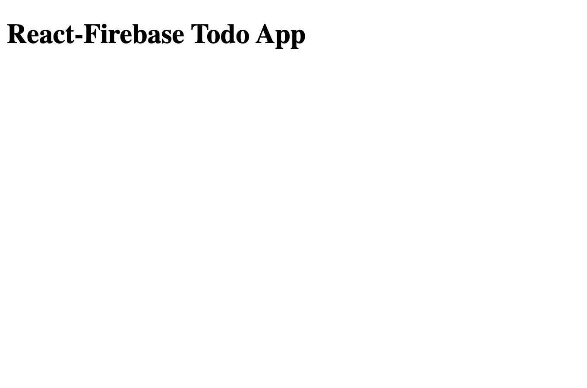

## Firebaseの設定

- `src`ディレクトリに`firebase`ディレクトリを作成する．
- `firebase`ディレクトリに`config.js`と`index.js`を作成する．
- それぞれ，以下のように編集する（APIキーなどの情報は各自のものを入力する）．これらのファイルがfirebaseと連携するための設定ファイルとなる．
- 事前準備で作成した`react-firebase`プロジェクトの情報を参照しよう（⚙ -> プロジェクトを設定 -> マイアプリ -> web）．
- ニックネームは適当（プロジェクト名と同じなど）でOK．表示されたAPIキーなどを`config.js`に記述する．

```js
// config.js
export const firebaseConfig = {
  apiKey: "XXXXXXX",
  authDomain: "XXXXXXX",
  databaseURL: "XXXXXXX",
  projectId: "XXXXXXX",
  storageBucket: "XXXXXXX",
  messagingSenderId: "XXXXXXX",
  appId: "XXXXXXX",
};
```

```js
// firebase.js
import firebase from 'firebase';
import { firebaseConfig } from './config';

export const firebaseApp = firebase.initializeApp(firebaseConfig);

export default firebase;
```

## データ一覧コンポーネントの実装

ここから，実際にFirestoreのデータを表示するコンポーネントを実装する．

- `src`ディレクトリに`components`ディレクトリを作成する．
- `components`ディレクトリ内に`ItemList.jsx`を作成する．
- `ItemList.jsx`に以下の内容を記述する．

```jsx
// ItemList.jsx
import React, { useState, useEffect } from 'react';
import firebase from '../firebase';

const ItemList = props => {

  const [todoList, setTodoList] = useState(null);

  // firestoreから全データを取得してstateに格納する関数
  const getTodosFromFirestore = async () => {
    const itemListArray = await firebase.firestore().collection('todos')
      .orderBy('limit')
      .get();
    const todoArray = itemListArray.docs.map(x => {
      return {
        id: x.id,
        data: x.data(),
      }
    })
    setTodoList(todoArray);
    return todoArray;
  }

  // useEffectを利用してFirestoreからデータの一覧を取得．
  useEffect(() => {
    const result = getTodosFromFirestore();
  }, [props])

  return (
    <div>
      <ul>
        {
          !todoList
            ? ''
            : todoList.map((x, index) =>
              <li key={index} id={x.id}>
                <input type="checkbox" value={x.id} />
                <button value={x.id}>delete</button>
                <p>締め切り：{x.data.limit.seconds}</p>
                <p>やること：{x.data.todo}</p>
              </li>
            )
        }
      </ul>
    </div>
  );
}
export default ItemList;
```

実行している処理は以下の通り．
- `useState`と`useEffect`の準備．
- Firestoreに保存されている全データを取得する関数を定義．
- `useEffect`を用いて上記の関数を実行し，stateに保存．
- 保存した配列データをレンダリング．

【Point】

- Firestore関連の関数（`get()`など）はPromiseを返すので，`async/await`を用いると見通しが良い．
- 取得したFirestoreのデータはそのままだと扱いにくいので，`map()`関数を用いて必要なデータだけを抽出している．

呼び出し元の`App.jsx`を以下のように編集し，`ItemList.jsx`を表示する．

```js
// App.jsx
import React from 'react';
import ItemList from './components/ItemList';

const App = () => {
  return (
    <div>
      <h1>React-Firebase Todo App</h1>
      <ItemList />
    </div>
  );
}
export default App;
```

下記のように，事前準備で登録したデータが表示されればOK！

（この時点では締め切り日時はtimestampの形式のままで問題ない．）

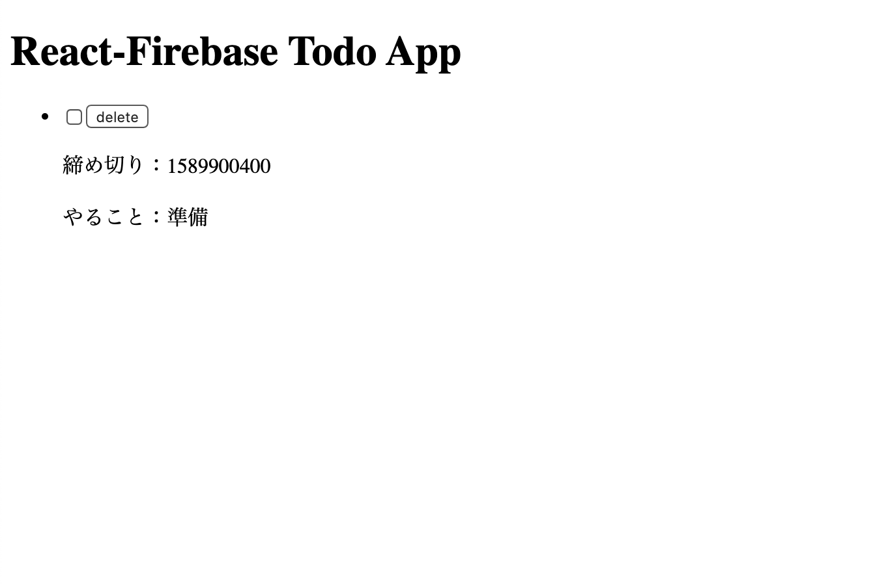


## 登録フォームコンポーネントの実装

続いて，Firestoreにデータを追加するコンポーネントを実装する．

- `components`ディレクトリ内に`InputForm.jsx`を作成する．
- `InputForm.jsx`に以下の内容を記述する．

```js
// InputForm.jsx
import React, { useState } from 'react';
import firebase from '../firebase';

const InputForm = ({ getTodosFromFirestore }) => {
  const [todo, setTodo] = useState('');
  const [limit, setLimit] = useState('');

  // Firestoreにデータを送信する関数
  const postDataToFirestore = async (collectionName, postData) => {
    const addedData = await firebase.firestore().collection(collectionName).add(postData);
    return addedData;
  }

  // submitボタンクリック時の処理
  const submitData = async () => {
    if (todo === '' || limit === '') { return false };
    const postData = {
      todo: todo,
      limit: new Date(limit),
      isDone: false,
    }
    const addedData = await postDataToFirestore('todos', postData);
    setTodo('');
    setLimit('');
    getTodosFromFirestore();
  }

  return (
    <form action="">
      <ul>
        <li>
          <label htmlFor="todo">やること：</label>
          <input
            type="text"
            id="todo"
            value={todo}
            onChange={e => setTodo(e.target.value)}
          />
        </li>
        <li>
          <label htmlFor="limit">締め切り：</label>
          <input
            type="datetime-local"
            id="limit"
            value={limit}
            onChange={e => setLimit(e.target.value)}
          />
        </li>
        <li>
          <button
            type="button"
            onClick={submitData}
          >submit</button>
        </li>
      </ul>
    </form>
  )
}

export default InputForm;
```

また，呼び出し元の`ItemList.jsx`を以下のように編集する．

```jsx
// ItemList.jsx
import React, { useState, useEffect } from 'react';
import firebase from '../firebase';
// ↓↓↓ 追加 ↓↓↓
import InputForm from './InputForm';

const ItemList = props => {

  // ...省略

  return (
    <div>
      {/* ↓↓↓ 追加 ↓↓↓ */}
      <InputForm
        getTodosFromFirestore={getTodosFromFirestore}
      />
      {/* 以下変更なし */}
      <ul>
        {
          !todoList
            ? ''
            : todoList.map((x, index) =>
              <li key={index} id={x.id}>
                <input type="checkbox" value={x.id} />
                <button value={x.id}>delete</button>
                <p>締め切り：{x.data.limit.seconds}</p>
                <p>やること：{x.data.todo}</p>
              </li>
            )
        }
      </ul>
    </div>
  );
}
export default ItemList;
```

【Point】
- formの各値を`onChange`を利用してstateに格納する．
- 一覧データ取得時と同様に`async / await`を用いてデータ登録を実行する．
- （「やること」「締め切り」のどちらかが空欄の場合は実行しない）
- データ登録終了後に`getTodosFromFirestore()`関数を実行して最新の一覧データを取得して画面を更新する．

下記のように，登録フォームから追加したデータが一覧に表示されればOK！

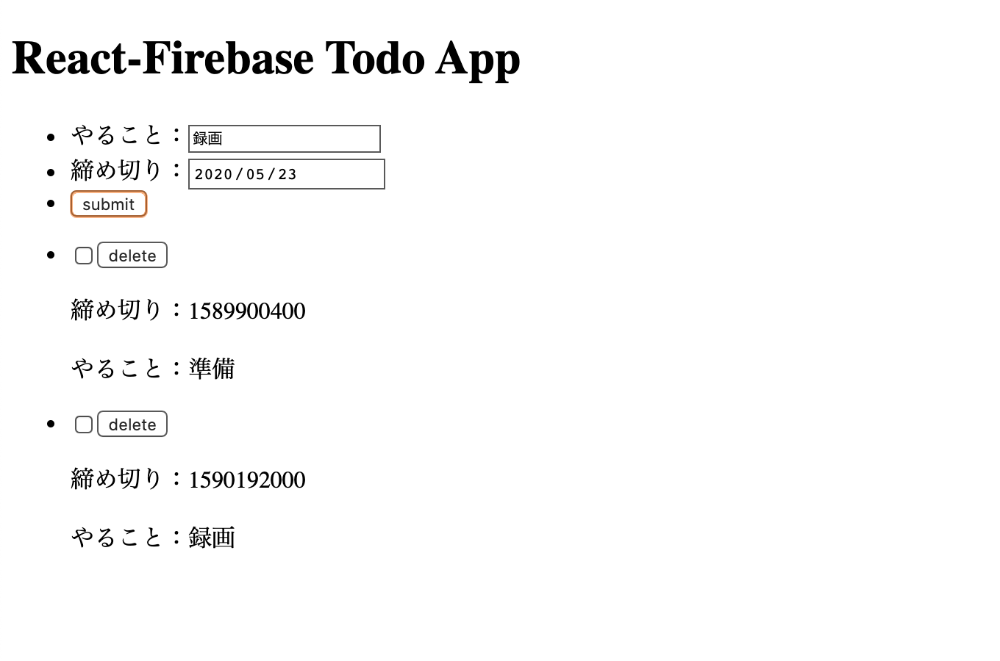


## todo表示用コンポーネントの切り出し

一覧表示と新規データの登録を実装したので，更新の処理と削除の処理を実装する．

しかし，一覧画面コンポーネント（`ItemList.jsx`）に表示内容をすべて記述している．

todo一つ一つの表示は別コンポーネントとして定義したい．以下の要領でtodoを表示するコンポーネントを作成し，`ItemList.jsx`から呼び出すことにする．

- `components`ディレクトリ内に`Item.jsx`を作成する．
- `Item.jsx`に以下の内容を記述する．

```js
// Item.jsx
import React from 'react';

const Item = ({ index, todo, getTodosFromFirestore }) => {
  // timestamp形式のデータをいい感じの形式に変換する関数
  const convertFromTimestampToDatetime = timestamp => {
    const _d = timestamp ? new Date(timestamp * 1000) : new Date();
    const Y = _d.getFullYear();
    const m = (_d.getMonth() + 1).toString().padStart(2, '0');
    const d = _d.getDate().toString().padStart(2, '0');
    const H = _d.getHours().toString().padStart(2, '0');
    const i = _d.getMinutes().toString().padStart(2, '0');
    const s = _d.getSeconds().toString().padStart(2, '0');
    return `${Y}/${m}/${d} ${H}:${i}:${s}`;
  }

  return (
    <li key={index} id={todo.id}>
      <input type="checkbox" value={todo.id} />
      <button value={todo.id}>delete</button>
      <p>締め切り：{convertFromTimestampToDatetime(todo.data.limit.seconds)}</p>
      <p>やること：{todo.data.todo}</p>
    </li>
  )
}
export default Item;
```

また，呼び出し元の`Itemlist.jsx`を以下のように編集する．

```js
// Itemlist.jsx
import React, { useState, useEffect } from 'react';
import firebase from '../firebase';
import InputForm from './InputForm';
// ↓↓↓ 追加 ↓↓↓
import Item from './Item';

const ItemList = props => {

  // ...省略

  return (
    <div>
      {/* ...省略 */}
      {/* ↓↓↓ 編集 ↓↓↓ */}
      <ul>
        {
          !todoList
            ? ''
            : todoList.map((x, index) =>
              // ↓新しく作成した`Item.jsx`
              <Item
                key={index}
                todo={x}
                index={index}
                getTodosFromFirestore={getTodosFromFirestore}
              />
              // ↓直接記述したものは削除してOK．
              // <li key={index} id={x.id}>
              //   <input type="checkbox" value={x.id} />
              //   <button value={x.id}>delete</button>
              //   <p>締め切り：{x.data.limit.seconds}</p>
              //   <p>やること：{x.data.todo}</p>
              // </li>
            )
        }
      </ul>
    </div>
  );
}
export default ItemList;
```

【Point】

- これまで`ItemList.jsx`に直接記述していたhtml要素を`Item.jsx`に記述し直した．
- Firestoreから取得した配列データとインデックスを`Item.jsx`に渡し，同様に表示．
- 締め切りをわかりやすくするため，timestampを日付形式に変換する関数を定義．

下記のように，日付時間の形式でデータが一覧表示されればOK！

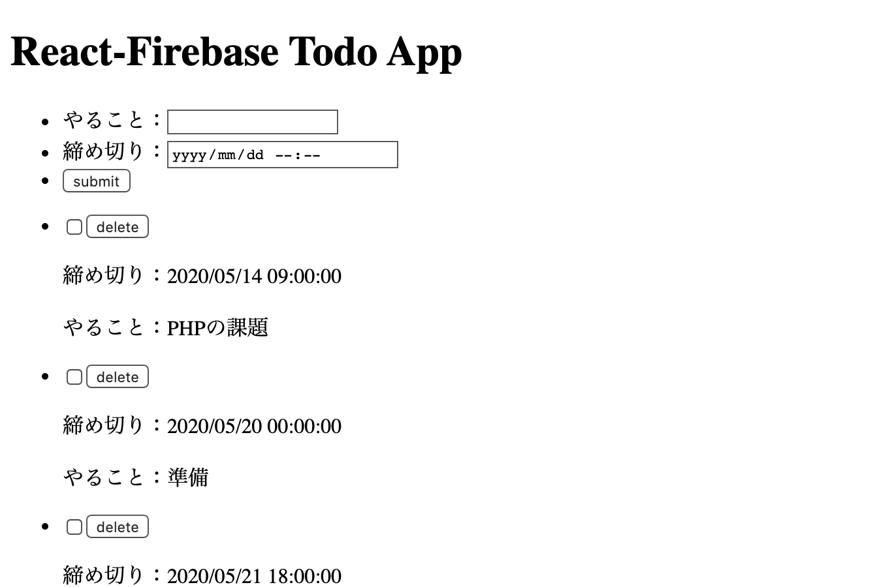


## 更新処理 / 削除処理の実装

続いて，更新と削除の処理を実装する．

- `Item.jsx`に各処理を追加する．
- チェックボックスの状況に応じて完了 / 未完了を更新．
- deleteボタンクリックでデータ削除．

```js
// Item.jsx
import React from 'react';
// ↓追加
import firebase from '../firebase';

const Item = ({ index, todo, getTodosFromFirestore }) => {

  // ...省略

  // ↓追加 ドキュメントIDを指定してFirestoreのデータを更新する関数
  const updateDataOnFirestore = async (collectionName, documentId, isDone) => {
    const removedData = await firebase.firestore()
      .collection(collectionName)
      .doc(documentId)
      .update({
        isDone: isDone ? false : true,
      });
    getTodosFromFirestore();
    return
  }

  // ↓追加 ドキュメントIDを指定してFirestoreのデータを削除する関数
  const deleteDataOnFirestore = async (collectionName, documentId) => {
    const removedData = await firebase.firestore()
      .collection(collectionName)
      .doc(documentId)
      .delete();
    getTodosFromFirestore();
    return
  }

  return (
    <li key={index} id={todo.id}>
      {/* ↓↓↓ 編集 ↓↓↓ */}
      <input
        type="checkbox"
        value={todo.id}
        checked={todo.data.isDone}
        onChange={e => updateDataOnFirestore('todos', todo.id, todo.data.isDone)}
      />
      {/* ↓↓↓ 編集 ↓↓↓ */}
      <button
        value={todo.id}
        onClick={e => deleteDataOnFirestore('todos', todo.id)}
      >delete</button>
      <p>締め切り：{convertFromTimestampToDatetime(todo.data.limit.seconds)}</p>
      <p>やること：{todo.data.todo}</p>
    </li>
  )
}

export default Item;
```

【Point】
- `update()`，`delete()`関数でFirestoreのデータを更新&削除する．
- ドキュメントIDを指定することで，指定したドキュメントの操作が行える．
- `todo.data.isDone`の値（true / false）に応じてチェックボックスの`checked`が変更される．

下記のように，チェックボックスクリックでisDoneがtrueに，deleteボタンクリックでデータ削除が実行されていればOK．firebaseのコンソールからデータを確認しよう！

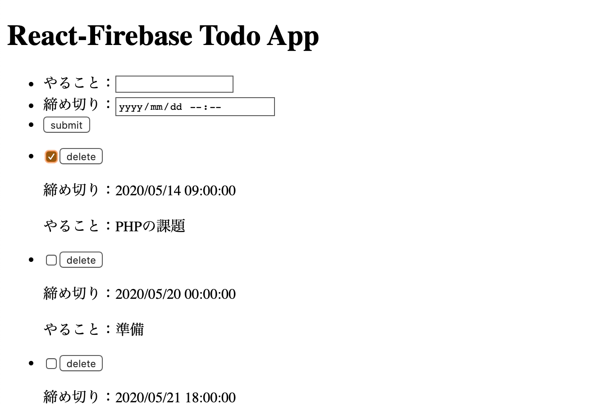

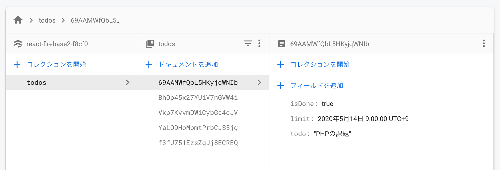


## 完了未完了でのデータ表示制御

ここまでで一通りのCRUD処理は完成したが，チェックボックスの状態だけではわかりにくい．

そこで，完了済みのtodoは取り消し線を表示し，未完了todoの下に表示させるようにする．

- `Item.jsx`の表示部分を編集する．
- isDoneの値によって取り消し線有無を変更．

```js
// Item.jsx
import React from 'react';
import firebase from '../firebase';

const Item = ({ index, todo, getTodosFromFirestore }) => {

  // ...省略

  return (
    <li key={index} id={todo.id}>
      <input
        type="checkbox"
        value={todo.id}
        checked={todo.data.isDone}
        onChange={e => updateDataOnFirestore('todos', todo.id, todo.data.isDone)}
      />
      <button
        value={todo.id}
        onClick={e => deleteDataOnFirestore('todos', todo.id)}
      >delete</button>
      {/* ↓↓↓ 編集 ↓↓↓ */}
      {
        !todo.data.isDone
          ? <div>
            <p>締め切り：{convertFromTimestampToDatetime(todo.data.limit.seconds)}</p>
            <p>やること：{todo.data.todo}</p>
          </div>
          : <div>
            <p><del>締め切り：{convertFromTimestampToDatetime(todo.data.limit.seconds)}</del></p>
            <p><del>やること：{todo.data.todo}</del></p>
          </div>
      }
    </li>
  )
}

export default Item;
```

【Point】
- `todo.data.isDone`の値によって取り消し線の有無を出し分ける．

ブラウザで確認し，チェック済みのtodoが取り消し線表示になっていればOK．

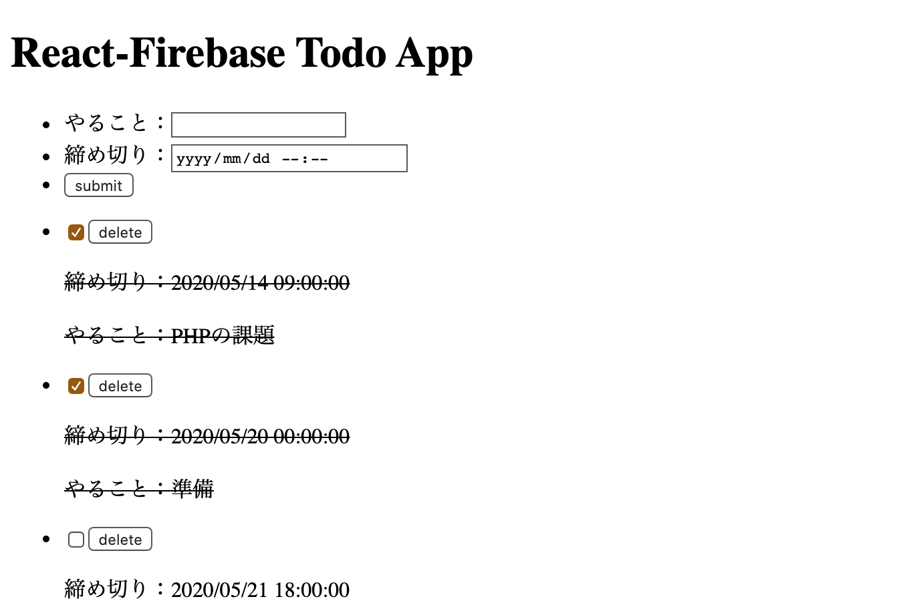

続いて，表示順を制御する．

- `Item.jsx`の一覧取得関数（`getTodosFromFirestore()`）を編集する．
- `.orderBy()`を追加し，`isDone`のパラメータで並び替えできるようにする．

```js
// ItemList.jsx

  // ...省略

  // firestoreから全データを取得してstateに格納する関数
  const getTodosFromFirestore = async () => {
    const itemListArray = await firebase.firestore().collection('todos')
      // ↓追加
      .orderBy('isDone')
      // ↓以降変更なし
      .orderBy('limit')
      .get();
    const todoArray = itemListArray.docs.map(x => {
      return {
        id: x.id,
        data: x.data(),
      }
    })
    setTodoList(todoArray);
    return todoArray;
  }

  // ...省略

```

このままだと検証画面でエラーになる．

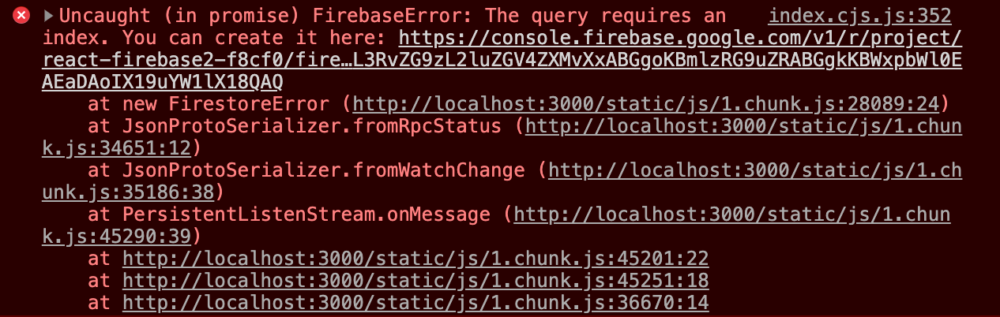

上記画面の一番上のリンクをクリックすると下記ページにリンクする．

「インデックスを作成」をクリックし，しばらく待つ．

ステータスが「有効」になれば完了．終わらない場合は「データ」タブなどに移動し，再度「インデックス」タブをクリックすると終わっている場合もある．

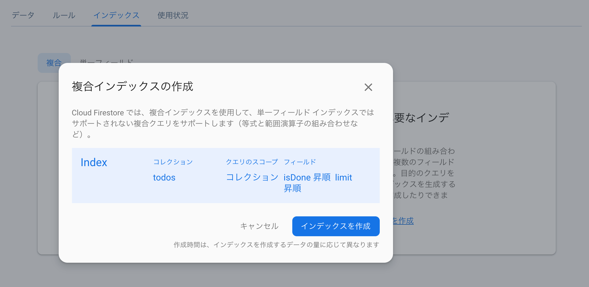

【Point】
- Firestoreの仕様上，複数のフィールドを用いてクエリ（`.orderBy()`，`.where()`など）を発行することはできない．
- この場合，「インデックス」を作成することで上記振る舞いを実現することができる．
- 現在では，エラーメッセージから直接インデックス作成画面にリンクされるため，検証画面を確認してリンク先で作成すれば良い．便利．

完了済みtodoが未完了todoのあとに表示され，取り消し線になっていればOK．

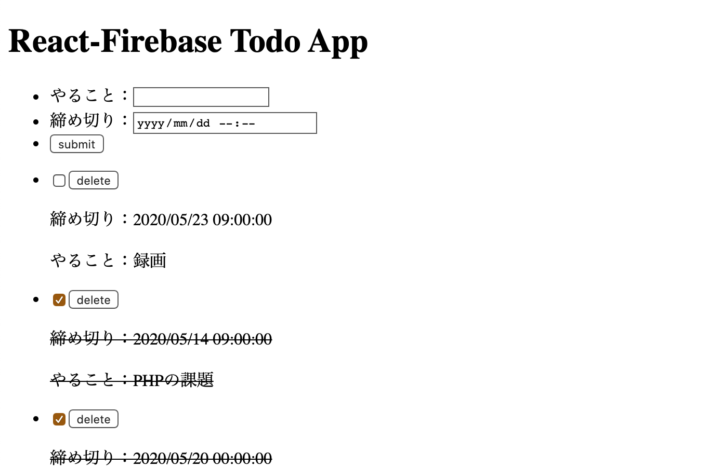


## やってみよう！！
- Firebaseを利用したReactアプリケーションを実装しよう！！
- オンライン口座で扱ったAPIと組み合わせると尚良し！！

今回はここまで( `･ω･)b